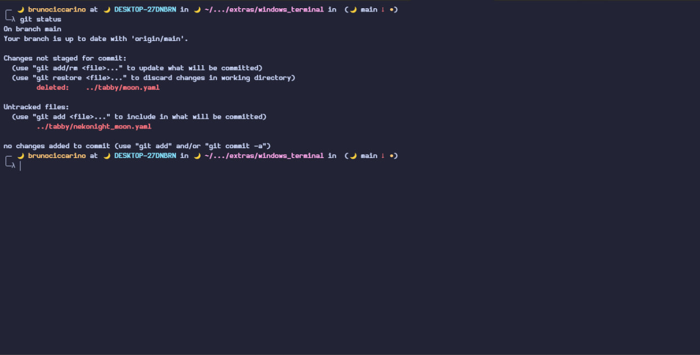
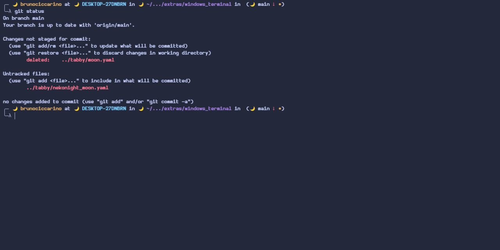
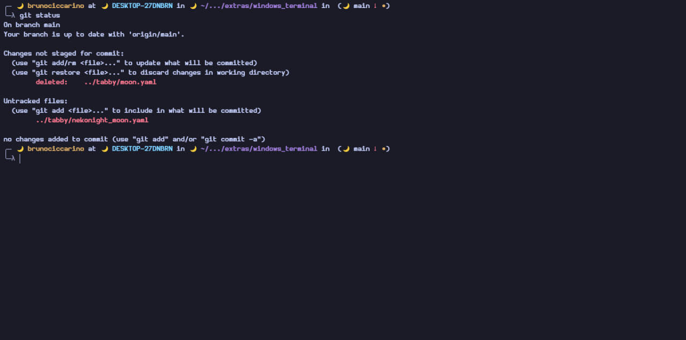
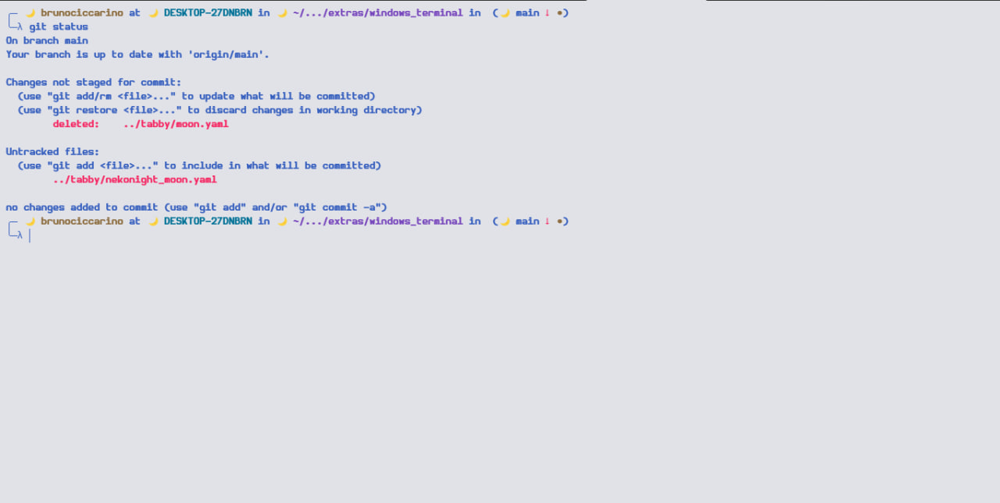

## windows-terminal 

Now we also have a theme for Windows Terminal

<table width="100%">
  <tr>
    <th>Moon</th>
    <th>Storm</th>
  </tr>
  <tr>
    <td width="50%">
      
    </td>
    <td width="50%">
      
    </td>
  </tr>
  <tr>
    <th>Night</th>
    <th>Day</th>
  </tr>
  <tr>
    <td width="50%">
      
    </td>
    <td width="50%">
      
    </td>
  </tr>
</table>

### LICENSE 

<a href="./LICENSE.txt">GPL-3</a>
